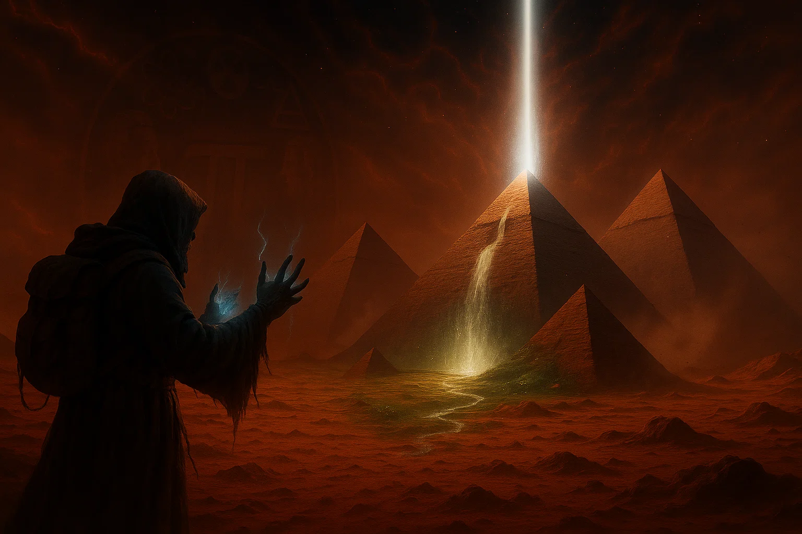

## Hi there 👋

- 🔭 I’m currently working on multiple Project, my main interest solving Physics Problem this inlcudes: Nuclear, Radiation, Atomic, and Quantum Physics.
- 🌱 I’m currently learning Deep Learning and Neural Network
- 👯 I’m looking to collaborate on Physics Papers, and Machine Learning Projects
- 💬 Ask me about I am Proffesional-Latex user, and experienced Physics educator
- 📫 How to reach me: you can email via aonsi@alexu.edu.eg or aonsi@aiu.edu.eg

⚡ My Quote ''*The world we perceive is not as it is, but as our minds reconstruct it. The inverted image on the retina is effortlessly corrected, yet this reveals a deeper mystery; how many other distortions, illusions, and assumptions has our mind silently 'fixed' for us? What if our greatest deception is not in what we fail to see, but in what we believe we see clearly? Wisdom begins when we question the very lens through which we perceive truth.*''
<!--
**aonsi55/aonsi55** is a ✨ _special_ ✨ repository because its `README.md` (this file) appears on your GitHub profile.

Here are some ideas to get you started:

- 🔭 I’m currently working on ...
- 🌱 I’m currently learning ...
- 👯 I’m looking to collaborate on ...
- 🤔 I’m looking for help with ...
- 💬 Ask me about ...
- 📫 How to reach me: ...
- 😄 Pronouns: ...
- ⚡ Fun fact: ...
-->
